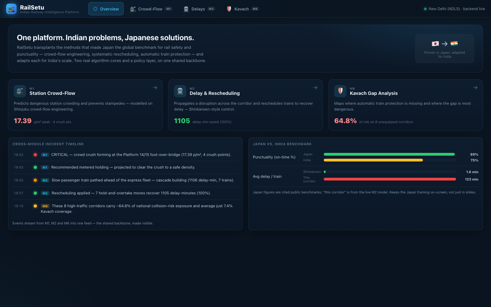
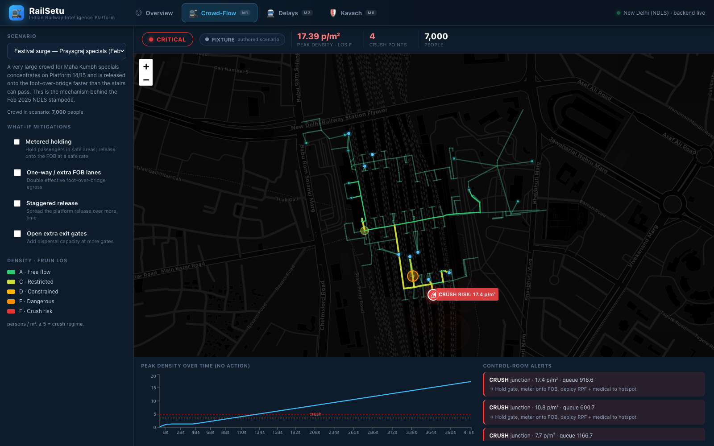
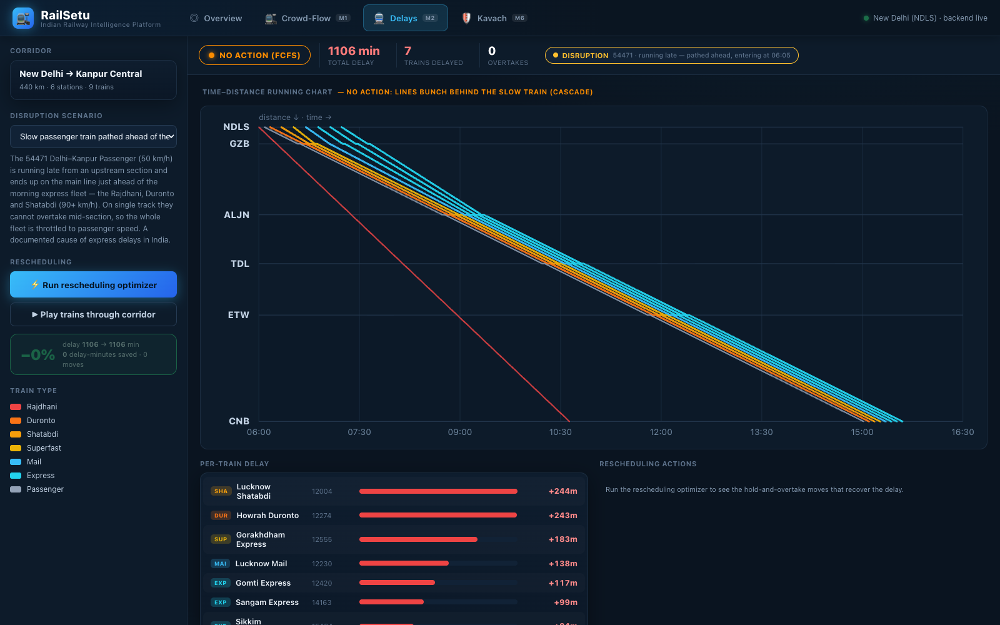
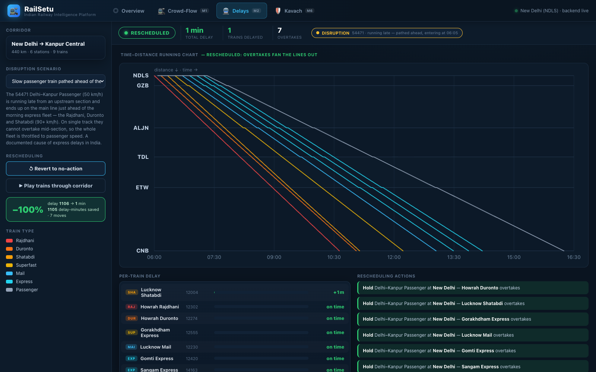
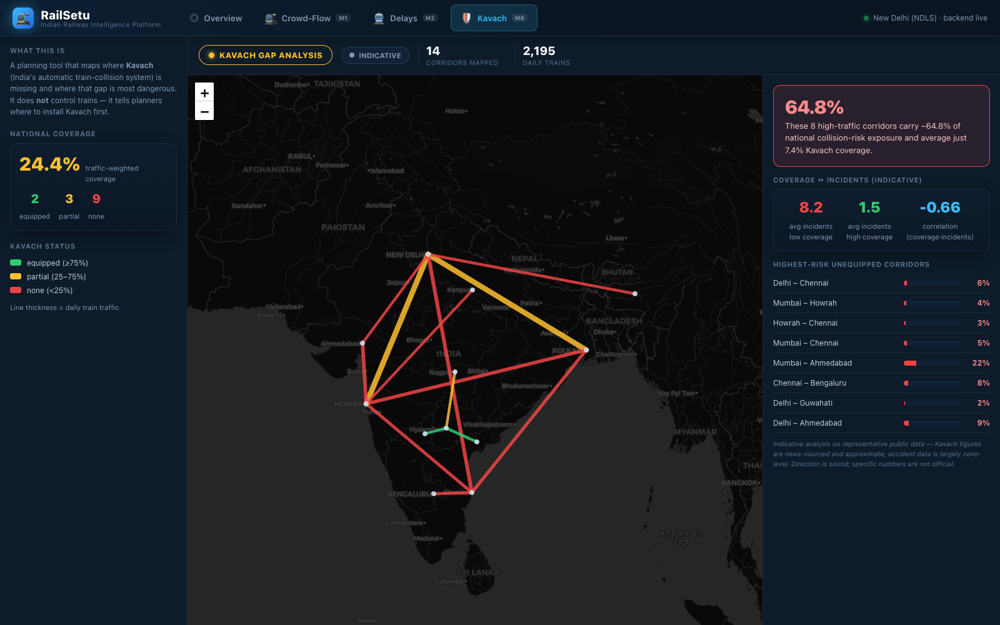

<div align="center">

# 🚉 RailSetu

### Indian Railway Intelligence Platform

**Helping India see risk *before* risk becomes loss.**

A modular software platform that makes Indian Railways safer and more punctual by
transplanting proven **Japanese** rail solutions — crowd-flow engineering,
systematic rescheduling, automatic train protection — and adapting each for
India's scale and crowding.


*Real pedestrian-flow modelling and constraint-based rescheduling on a shared data backbone — **not** an LLM wrapper.*

</div>

---

## Table of contents

- [Why RailSetu](#why-railsetu)
- [The platform at a glance](#the-platform-at-a-glance)
- [The "Japan solved it" thesis](#the-japan-solved-it-thesis)
- [Module M1 — Station Crowd-Flow & Stampede Prevention](#module-m1--station-crowd-flow--stampede-prevention)
- [Module M2 — Delay Propagation & Smart Rescheduling](#module-m2--delay-propagation--smart-rescheduling)
- [Module M6 — Kavach Gap Analysis](#module-m6--kavach-gap-analysis)
- [The unified dashboard](#the-unified-dashboard)
- [Why this is real engineering, not a wrapper](#why-this-is-real-engineering-not-a-wrapper)
- [Architecture](#architecture)
- [API reference](#api-reference)
- [Run it locally](#run-it-locally)
- [Going live — real-time data](#going-live--real-time-data)
- [Data sources & honesty policy](#data-sources--honesty-policy)
- [Tech stack](#tech-stack)
- [Roadmap](#roadmap)
- [Team](#team)

---

## Why RailSetu

For most of us a railway station is just a place. For millions of Indians it is
where a father leaves for work, where a student begins a dream, where a mother
waits to see her son after years. **Every day, more than 13 million people place
their trust in Indian Railways.**

Sometimes that trust is broken — and almost always, *nobody wanted it to happen.*

- **February 2025, New Delhi Railway Station.** Thousands of devotees gathered for
  the Maha Kumbh. Within minutes, confusion became panic on a foot-over-bridge
  between platforms 14 and 15. **18 lives were lost.** The problem was simple:
  *nobody knew exactly where the danger was building until it was already too late.*
- **June 2023, Coromandel Express.** ~290 lives lost, 1,000+ injured. Again the
  question: *could the risk have been identified before it became a headline?*

RailSetu exists to answer that question with **intelligence instead of hindsight** —
to see pressure building near a staircase before people notice it, to predict how
one late train paralyses a corridor before it does, and to show planners exactly
where safety coverage is missing before the next accident.

> Because the strongest infrastructure is not measured by the trains it moves.
> It is measured by the lives it protects.

---

## The platform at a glance

Three modules, each pairing a documented Indian problem with the Japanese method
that solved it — **two real algorithm cores plus a policy layer**, on one shared
backbone, behind one control-room dashboard.

| Module | What it does | Japanese method adapted | Status |
|---|---|---|:---:|
| **M1 · Crowd-Flow** | Predicts dangerous station crowding and prevents stampedes (New Delhi / NDLS) | Shinjuku pedestrian crowd-flow engineering | ✅ |
| **M2 · Delays** | Propagates a disruption across a corridor and reschedules trains to recover delay (Delhi → Kanpur) | Shinkansen systematic rescheduling / ATOS central control | ✅ |
| **M6 · Kavach** | Maps where automatic train protection is missing and where the gap is most dangerous | Mature Automatic Train Control (gap analysis) | ✅ |

### The demo in three beats

> **1 · M1** — Load *Festival surge* and the New Delhi map floods red: a crush
> forming on the platform 14/15 foot-over-bridge, exactly where 18 died in Feb 2025.
> Toggle **Metered holding** → peak density falls **−81 %** (17.4 → 3.3 p/m²) and
> crush points go **4 → 0**.
>
> **2 · M2** — A slow passenger train is pathed ahead of the express fleet; the
> running chart shows the cascade (**1,106 delay-minutes**). Hit the optimizer and
> the lines *physically fan out* as expresses overtake: **~1,100 delay-minutes
> recovered (≈ 99 %)**.
>
> **3 · M6** — The India map shows **8 high-traffic corridors carrying ~65 % of
> national collision-risk exposure at just ~7 % Kavach coverage** (indicative).

<div align="center">



*The Overview — live module cards, the cross-module incident timeline, and the Japan-vs-India benchmark.*

</div>

---

## The "Japan solved it" thesis

India's urban and trunk rail is **overloaded, not under-used** — many routes run at
over 150 % capacity. The winning approach isn't "make trains smarter" in the
abstract; it's to target India's documented failure points and transplant a proven
fix for each.

| India problem | Japanese solution adapted | RailSetu module |
|---|---|:---:|
| Deadly station stampedes from overcrowding; no holding areas, no flow planning | Crowd-flow engineering at Shinjuku (~3 M/day): pedestrian O-D forecasting + simulation to find choke points and keep flow unimpeded | **M1** |
| One late train cascades network-wide; recovery is manual and ad-hoc | Punctuality through *systematic rescheduling*, not abundant resources (Tokaido Shinkansen ~1.6 min avg delay); ATOS-style central control | **M2** |
| Slow, partial rollout of anti-collision protection | Mature Automatic Train Control enforcing safe speed/separation — presented as coverage gap analysis + risk-based prioritisation | **M6** |

---

## Module M1 — Station Crowd-Flow & Stampede Prevention

> **India problem:** recurring deadly stampedes from overcrowding, no holding areas,
> and no unidirectional flow planning at major stations during surges.
> **Japan solution adapted:** Shinjuku-style pedestrian origin-destination
> forecasting and simulation to find choke points and keep flow unimpeded.

<div align="center">



*Festival surge on NDLS — the foot-over-bridge lights red, crush points pulse, alerts recommend actions.*

</div>

### What it does (operator's view)

- **Live station map** of New Delhi (NDLS) built from real OpenStreetMap geometry.
- **Pedestrian flow simulation** — thousands of people move off platforms toward
  exits during a train arrival or festival surge.
- **Density heatmap** graded by the **Fruin Level-of-Service** standard (persons/m²);
  the lethal crush regime (≥ 5 p/m²) pulses red.
- **Surge scenarios** — Normal evening, Festival surge (Feb 2025 pattern), Double arrival.
- **What-if mitigation sandbox** — toggle *Metered holding · One-way / extra FOB
  lanes · Staggered release · Extra exits* and watch the risk drop with a live headline.
- **Control-room alerts** — ranked danger zones, each with a recommended action.

### How the model actually works

This is a **macroscopic origin-destination pedestrian-flow model**, not an animation:

1. **Real geometry.** The station is a walkable graph built from a frozen
   OpenStreetMap snapshot — **10 platforms, 50 staircases, 100+ footways, 12 exits** —
   snapped into one connected network.
2. **Capacity-constrained flow.** People are injected at platforms and routed to
   their nearest exits; every corridor passes at most ~**1.3 persons/m/s** (the
   Fruin/HCM maximum specific flow, reduced on stairs). When demand exceeds
   capacity, people queue and **density rises**.
3. **The model finds the choke point by itself.** The crush concentrates at node
   `n150` — the **platform 14/15 foot-over-bridge landing**, an *articulation point*
   every passenger on that platform must cross. That is exactly where Feb 2025 happened.
4. **The fix is the science.** A stampede happens when there is **no back-pressure** —
   people keep pressing into an already-packed space. The *Metered holding*
   mitigation adds that control (hold in roomy areas, release onto the FOB at a safe
   rate). That single change clears the crush in the model.

| Scenario | Peak density | Crush points | Status |
|---|:---:|:---:|:---:|
| Normal evening | 3.1 p/m² | 0 | 🟢 MANAGED |
| **Festival surge (Feb 2025)** | **17.4 p/m²** | **4** | 🔴 CRITICAL |
| Festival surge **+ Metered holding** | **3.3 p/m²** (−81 %) | **0** | 🟢 MANAGED |

---

## Module M2 — Delay Propagation & Smart Rescheduling

> **India problem:** one late train on a saturated corridor cascades network-wide;
> recovery is manual. **Japan solution adapted:** punctuality from *systematic
> rescheduling* — holds, overtakes, re-platforming — computed centrally.

<div align="center">




*No-action: the lines bunch behind the slow train (cascade). Rescheduled: they fan out as expresses overtake.*

</div>

### The corridor

**New Delhi → Kanpur Central** — 440 km, 6 stations, 9 real trains (Rajdhani,
Duronto, Shatabdi, Gorakhdham, Lucknow Mail…) on a representative timetable.

### The two engines

- **Delay-propagation simulator (M2.2).** A section-by-section dispatch model.
  Inject a disruption — e.g. a slow passenger train pathed ahead of the fleet — and
  the cascade propagates: on single track the expresses can't overtake mid-section,
  so the whole fleet is throttled to passenger speed.
- **Rescheduling optimizer (M2.3).** The "priority" dispatch policy applies the
  **fastest-first (SPT) rule** with hold-and-overtake at loop stations — provably
  minimising total delay on a no-overtake section — and never makes total delay
  worse. Output: an explicit list of moves ("Hold the passenger at Aligarh —
  Duronto overtakes").

> **Is it hardcoded? No.** The timetable is an authored fixture; the **delay numbers
> and the optimization are computed live** by running the corridor simulation twice
> (first-come-first-served vs. optimized) and diffing them. Change a train's speed
> or the disruption and the result changes.

### The signature visualization

A **time–distance "string-line" (Marey) running chart** — the classic railway
diagram. Hit the optimizer and the chart **morphs in real time**: the slow train is
held back, the expresses fan ahead, the delay counter ticks **1,106 → 1**, and a
**"play" button** sweeps a time-cursor with glowing train dots running down the corridor.

| Scenario | No action | Rescheduled | Saved |
|---|:---:|:---:|:---:|
| Normal running | 1 min | 1 min | — |
| **Slow passenger pathed ahead** | **1,106 min** | **1 min** | **≈ 99 %** |
| Passenger-ahead + fault at Aligarh | 648 min | 14 min | ≈ 98 % |

---

## Module M6 — Kavach Gap Analysis

> **Important:** M6 is **not** Kavach and does not control trains. *Kavach* is
> India's physical anti-collision hardware that automatically brakes a train.
> **M6 is a planning tool that maps where Kavach is missing and where the gap is most
> dangerous** — *Kavach is the seatbelt; M6 tells you which cars lack one and which
> are driven on the most dangerous roads.*

<div align="center">



*India coverage map (red = unequipped, weighted by traffic) + the gap × accident correlation panel.*

</div>

- **Coverage map (M6.1)** — 14 major corridors coloured by Kavach status
  (equipped / partial / none), line thickness = daily traffic.
- **Gap × accident correlation (M6.3)** — overlays representative accident data and
  surfaces the policy headline:
  > **These 8 high-traffic corridors carry ~65 % of national collision-risk exposure
  > and average just ~7 % Kavach coverage.**
- Low-coverage corridors show **8.2** avg incidents vs **1.5** for high-coverage
  (Pearson **−0.66**) — an *indicative* negative correlation, labelled as such.

---

## The unified dashboard

The **Overview** is what makes RailSetu a *platform*, not three demos:

- **Module cards** with live stats pulled from each engine, click-through to open.
- **D1 · Cross-module incident timeline** — M1 crowd alerts, M2 delay cascades and
  M6 findings stream into **one chronological feed**, proving the shared backbone is real.
- **D2 · Japan vs. India benchmark** — cited Japanese figures (Shinkansen
  punctuality / ~1.6 min avg delay) next to a **live figure from our own M2 model**.

---

## Why this is real engineering, not a wrapper

| Claim | Evidence |
|---|---|
| Real pedestrian-flow model | Capacity-constrained O-D flow on an OSM-derived graph, Fruin LOS density grading, back-pressure metering — [`m1_crowd/simulation.py`](backend/app/m1_crowd/simulation.py) |
| Real optimization | Section-by-section dispatch + fastest-first (SPT) rescheduling, computed live and diffed against FCFS — [`m2_delay/engine.py`](backend/app/m2_delay/engine.py) |
| Real geospatial analysis | Corridor risk-exposure + correlation over public-style data — [`m6_kavach/service.py`](backend/app/m6_kavach/service.py) |
| Real geometry | Live OpenStreetMap → snapped walk graph — [`scripts/build_station_graph.py`](backend/scripts/build_station_graph.py) |
| Honest about data | Every output is labelled **real / modelled / indicative / estimated** in the UI |

No large language model is in any decision path. The cores are algorithms.

---

## Architecture

```
railsetu/
├── backend/                          FastAPI + the simulation / optimization cores
│   ├── app/
│   │   ├── main.py                    API surface (see reference below)
│   │   ├── config.py                  env-driven settings (RAILSETU_*) + logging
│   │   ├── data/station.py            loads / hot-reloads the routable NDLS graph
│   │   ├── m1_crowd/
│   │   │   ├── simulation.py          pedestrian O-D flow + density/LOS + crush detection
│   │   │   └── scenarios.py           committed demand scenarios
│   │   ├── m2_delay/                  ── Delay & rescheduling ──
│   │   │   ├── network.py             corridor + representative timetable
│   │   │   ├── engine.py              propagation + fastest-first optimizer
│   │   │   ├── scenarios.py           disruption scenarios
│   │   │   └── service.py             API payload builders
│   │   ├── m6_kavach/                 ── Kavach gap analysis ──
│   │   │   ├── data.py                corridors + coverage + accident data
│   │   │   └── service.py             coverage map + correlation
│   │   ├── demand/                    DemandProvider seam: fixtures | live rail API
│   │   ├── clients/rail_api.py        third-party (RapidAPI) live-arrivals adapter
│   │   └── ingest/                    measured-crowd ingestion (CCTV/WiFi stub) + calibration
│   ├── scripts/build_station_graph.py OSM → connected walk graph (run on a schedule)
│   ├── .env.example                   all config knobs, documented
│   └── fixtures/                      frozen snapshots (OSM graph, sample observations)
└── frontend/                         React + Leaflet + Recharts control room
    └── src/
        ├── App.jsx                    platform shell + module navigation
        ├── views/                     Overview · M1Crowd · M2Delays · M6Kavach
        ├── components/                StationMap · IndiaMap · StringLineChart
        ├── api.js                     typed fetch client (M1 + M2 + M6)
        └── los.js                     Fruin LOS colour scale
```

---

## API reference

**M1 — Crowd-Flow**

| Endpoint | Purpose |
|---|---|
| `GET /api/health` | Liveness + station counts, demand-provider / sensor / calibration status |
| `GET /api/station` | Station geometry (nodes, edges, platforms, exits) for the map |
| `GET /api/scenarios` | Available demand scenarios (+ `live_now` when live data is on) |
| `POST /api/simulate` | Run a scenario (+ optional mitigations); per-edge/node density, hotspots, timeline |
| `POST /api/whatif` | Baseline vs. mitigated side by side with headline impact |
| `GET /api/live/demand` | Inspect the demand the live provider currently derives (transparency) |
| `POST /api/station/refresh` | Hot-reload the graph fixture after a scheduled OSM rebuild (guarded) |
| `POST /api/calibration/run` · `/reset` | Calibrate corridor capacities against measured density |

**M2 — Delays** · **M6 — Kavach**

| Endpoint | Purpose |
|---|---|
| `GET /api/m2/network` | Corridor geometry + planned train sheet |
| `GET /api/m2/scenarios` | Disruption scenarios |
| `POST /api/m2/simulate` | Propagate the disruption (FCFS) and the rescheduled plan, with impact |
| `GET /api/m6/coverage` | Kavach coverage map: corridors with status, geometry, risk exposure |
| `GET /api/m6/correlation` | Gap × accident correlation (indicative policy analysis) |

Interactive docs at `http://127.0.0.1:8000/docs`.

---

## Run it locally

```bash
./run.sh          # starts backend (:8000) + frontend (:5173)
```

Then open **http://localhost:5173**.

<details>
<summary>Run the two halves manually</summary>

```bash
# backend
cd backend
python3 -m venv .venv && source .venv/bin/activate
pip install -r requirements.txt
uvicorn app.main:app --reload --port 8000

# frontend (separate terminal)
cd frontend
npm install
npm run dev
```
</details>

Everything is **fixture-driven and network-free by default**, so the demo is
deterministic and never depends on a live call.

---

## Going live — real-time data

The defaults are fixtures so the demo is reproducible. Production swaps the static
inputs for live feeds **without touching the simulation core**, via env config
(see [`backend/.env.example`](backend/.env.example)):

- **Live demand.** A pluggable `DemandProvider` ([`app/demand/`](backend/app/demand/))
  is the seam between data and physics. `RAILSETU_DEMAND_PROVIDER=live` switches from
  committed scenarios to a third-party Indian-Railways live-arrivals feed; the
  adapter maps each arriving train's platform → graph node and estimates the
  alighting crowd (these APIs return arrivals, not counts — tune the estimation
  constants, or feed PRS/UTS later). If the feed is down it falls back to a fixture
  and flags it.
- **Measured crowd + calibration.** A `CrowdSensor` ([`app/ingest/`](backend/app/ingest/))
  ingests *observed aggregate* density (a real one wraps CCTV crowd-counting CV or
  anonymised WiFi/AFC counts — **aggregate only, never individuals**).
  `POST /api/calibration/run` nudges corridor capacities toward reality.
- **Geometry refresh.** Re-run `scripts/build_station_graph.py` on a schedule, then
  `POST /api/station/refresh` hot-reloads it.

> The third-party live API is an NTES scraper — fine for a pilot; a true deployment
> should use authorised CRIS / RailTel / zonal-railway data access.

---

## Data sources & honesty policy

Judges reward honesty; overclaiming loses. Every figure carries one of four labels,
and the UI shows it:

| Label | Means | Examples |
|---|---|---|
| **Real** | Exact, sourced facts | NDLS station geometry (OpenStreetMap), the train list, festival dates |
| **Modelled** | Computed by our algorithms; real vs. our own baseline, not ground-truth-validated | Crowd densities, delay cascades, delay-minutes saved |
| **Indicative** | Directionally sound on coarse public data; specific numbers are soft | Kavach coverage %, gap × accident correlation |
| **Estimated** | Derived where the source gives no number | Passenger load / platform from the live arrivals feed |

**Privacy & non-goals:** aggregate density only (never identifiable individuals);
no live signalling integration; no trackside hardware; this is software
decision-support, calibrated to standard pedestrian-flow constants and to be tuned
against site data before any real deployment.

---

## Tech stack

| Layer | Choice |
|---|---|
| **Backend** | Python · FastAPI · NetworkX (graphs) · httpx (live feed) · pydantic-settings (config) |
| **M1 core** | Macroscopic O-D pedestrian-flow simulation, Fruin LOS density grading |
| **M2 core** | Section-by-section dispatch + fastest-first (SPT) rescheduling heuristic |
| **M6 core** | Geospatial risk-exposure scoring + correlation |
| **Frontend** | React 18 · Vite · Leaflet (maps) · Recharts (charts) · hand-rolled SVG string-line chart |
| **Data** | OpenStreetMap (Overpass) · representative open timetable · public Kavach/accident data — all committed as frozen fixtures |

---

## Roadmap

Deferred for the hackathon, **architected on the same backbone**:

- **M1.8 — Public Crowd Status App (PWA):** passenger-facing live crowd level per
  gate with directional guidance.
- **M1.9 — Festival Surge Calendar:** forward-looking "festival in 3 days" forecasting.
- **M3 — Predictive Track Maintenance:** CV defect detection from cab-camera / drone footage.
- **M4 — Level-Crossing Safety:** CV obstacle detection + emergency dispatch.
- **M5 — Waitlist & coach-load intelligence.**
- **M2.6 — Historical validation:** back-test the optimizer on real NTES delay history.

---

## Team

Built by **Saswata · Mahir · Dhruv** for **FAR AWAY 2026** (Railways track).

<div align="center">

*Framed preventively, in memory of those lost — the goal is to save lives.*

**If even one family is spared the pain of another New Delhi stampede,
every line of code was worth it.**

</div>
