<div align="center">

# 🚉 RailSetu

### Indian Railway Intelligence Platform

**Helping India see risk *before* risk becomes loss.**

A control-room platform that makes Indian Railways safer and more punctual by
transplanting proven **Japanese** rail methods — crowd-flow engineering,
systematic rescheduling, automatic train protection — and adapting each for
India's scale and crowding. Every operating rule it runs on is a **versioned,
attributed, revertible document** you can amend from the browser.


*Real pedestrian-flow physics, constraint-based rescheduling, two trained
networks and a git-shaped policy register — on one shared backbone. **Not** an
LLM wrapper.*

### ▶️ Watch the demo

[](https://youtu.be/1xAeFJn1vCQ)

</div>

---

## Table of contents

- [Why RailSetu](#why-railsetu)
- [What the platform does](#what-the-platform-does)
- [The Policy Register](#the-policy-register) ← *the Round 2 capability*
- [The 3D layer](#the-3d-layer)
- [Station Crowd-Flow](#station-crowd-flow)
- [Delay Propagation & Rescheduling](#delay-propagation--rescheduling)
- [Protection Gap Analysis](#protection-gap-analysis)
- [Surface Defect Inspection](#surface-defect-inspection)
- [The unified overview](#the-unified-overview)
- [Architecture](#architecture)
- [Why this is real engineering](#why-this-is-real-engineering)
- [API reference](#api-reference)
- [Run it locally](#run-it-locally)
- [Deployment](#deployment)
- [Testing](#testing)
- [Data sources & honesty policy](#data-sources--honesty-policy)
- [Roadmap](#roadmap)
- [Team](#team)

---

## Why RailSetu

For most of us a railway station is just a place. For millions of Indians it is
where a father leaves for work, where a student begins a dream, where a mother
waits to see her son after years. **Every day, more than 13 million people place
their trust in Indian Railways.**

Sometimes that trust is broken — and almost always, *nobody wanted it to happen.*

- **February 2025, New Delhi Railway Station.** Thousands of devotees gathered
  for the Maha Kumbh. Within minutes, confusion became panic on a foot-over-bridge
  between platforms 14 and 15. **18 lives were lost.** The problem was simple:
  *nobody knew exactly where the danger was building until it was already too late.*
- **June 2023, Coromandel Express.** ~290 lives lost, 1,000+ injured. Again the
  question: *could the risk have been identified before it became a headline?*

RailSetu answers that with **intelligence instead of hindsight** — seeing pressure
build near a staircase before people notice it, predicting how one late train
paralyses a corridor before it does, showing planners where protection is missing,
and reading a rail photograph for damage the eye would pass over.

> Because the strongest infrastructure is not measured by the trains it moves.
> It is measured by the lives it protects.

---

## What the platform does

Six views on one shared backbone, behind one control-room shell.

| View | What it answers | How |
|---|---|---|
| **Overview** | What is happening across the platform right now? | Live cards, one cross-module incident feed, Japan-vs-India benchmark |
| **Crowd-Flow** | Where will a station become dangerous, and what stops it? | Capacity-constrained pedestrian flow on a real OSM walk graph, in 2D and 3D |
| **Delays** | How does one late train paralyse a corridor, and what recovers it? | Section-by-section dispatch simulation + a rescheduling optimizer |
| **Kavach** | Where is anti-collision protection missing, and where does that matter most? | Traffic-weighted coverage and risk exposure over 14 trunk corridors |
| **Defects** | What is wrong with this piece of rail, and where? | Two trained CNNs — a classifier and a localizer — on CPU |
| **Policy** | Who changed the rules, why, and can we put them back? | A git-shaped register over the documents every model above reads |

The last one is the point of the platform, not a sixth feature. **Every number in
the other five is produced under a policy document that a named person amended at
a recorded time and place, and that anyone can preview, diff, or revert.**

<div align="center">

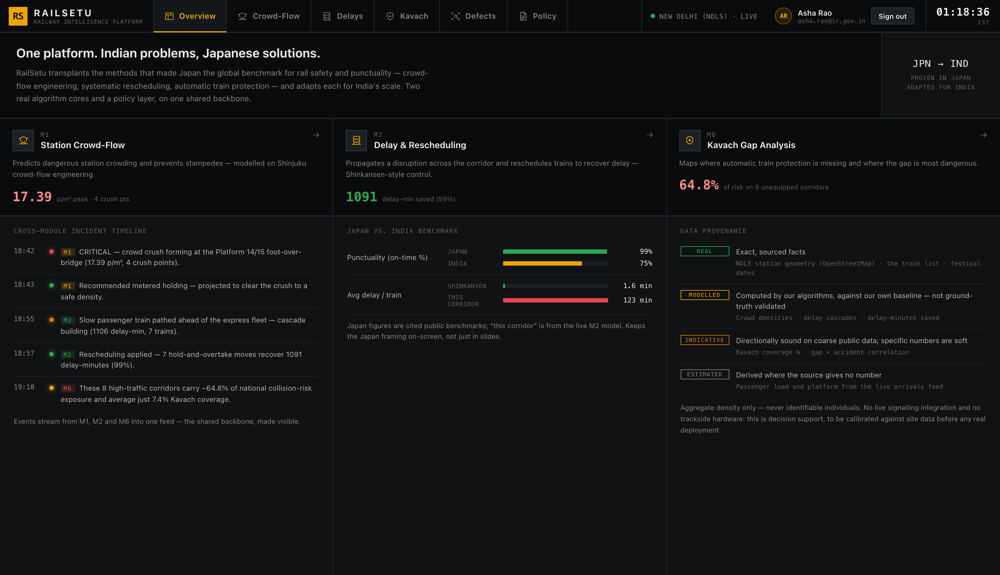

*The Overview — live cards from each engine, the cross-module incident feed, the
Japan benchmark, and the provenance key that labels every figure on the platform.*

</div>

### The demo in five beats

> **1 · Crowd-Flow** — Load *Festival surge* and New Delhi floods red: a crush on
> the platform 14/15 foot-over-bridge, exactly where 18 died in Feb 2025.
> **17.39 p/m², LOS F, 4 crush points.** Run the optimizer: it simulates all 16
> combinations of the four control measures and applies the winner —
> **3.21 p/m², LOS D, 0 crush points, and more people cleared than before.**
>
> **2 · In 3D** — the same result, walkable. Stand on the foot-over-bridge and
> watch the density columns rise through the Fruin bands.
>
> **3 · Delays** — a slow passenger train is pathed ahead of the morning express
> fleet. The running chart bunches: **1,106 delay-minutes across 7 trains.** Run
> the optimizer and the lines fan out as expresses overtake —
> **15 minutes, 1 train, 1,091 delay-minutes recovered (98.6%).**
>
> **4 · Defects** — drop in a railhead photograph. Two networks answer in under a
> second: what the defect is, where it is, and an estimated severity.
>
> **5 · Policy** — open *Crowd safety thresholds*, lower the crush line, and
> **preview** it: the crowd, corridor and protection models re-run under the draft
> and report **crush points 4 → 5** before anything is activated. Push it with a
> title and a reason; it lands in the change log with your name, your address, the
> coordinates you pushed from, a GitHub-style diff, and a **Revert** button.

---

## The Policy Register

> **Challenge #985 — Policy Simulation: Change History.** *Extend the MVP with a
> capability related to previewing rule or policy changes before activation.
> Record meaningful changes over time and make them easy to inspect.*

### The idea

A railway does not run on code. It runs on **rules that people decide** — the
density at which a location is declared dangerous, how long a train may be held
so another can pass, what coverage counts as "equipped". Those rules were
scattered through the models as literals. Nobody could say who last changed a
threshold, when, on what grounds, or put it back.

The Policy Register makes each rule a **document**: owned by a department,
versioned, attributed, diffable, previewable, and revertible. The platform then
*operates on those documents*. Nothing is duplicated — there is one source of
truth for a rule, and it is the register.

> **This is policy, not configuration, and not code.** Change `crush_above` from
> 5.0 to 3.6 and the crowd model reports a fifth crush point under the same
> surge — while the source tree's fingerprint is byte-for-byte identical. The
> platform behaved differently because the *rules* changed, which is exactly what
> a policy register is for.

### The library

Eight documents in two kinds. A real rulebook contains both, so the register does.

<div align="center">

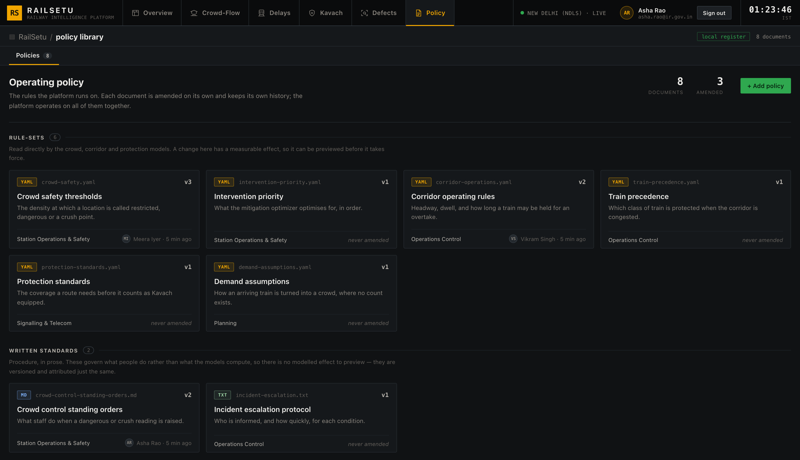

*Every document, its format, its department, its version and who last touched it.*

</div>

**Rule-sets** — structured YAML, parsed and validated field by field, read
directly by the models. A change here has a measurable consequence, so it can be
previewed.

| Document | Department | Governs |
|---|---|---|
| `crowd-safety.yaml` | Station Operations & Safety | The density bands: restricted → constrained → dangerous → crush, and the metered-holding release density |
| `intervention-priority.yaml` | Station Operations & Safety | What the mitigation optimizer ranks by, and in what order |
| `corridor-operations.yaml` | Operations Control | Minimum headway, station and terminal dwell, the overtake hold window |
| `train-precedence.yaml` | Operations Control | Which class of train is protected when the corridor is congested |
| `protection-standards.yaml` | Signalling & Telecom | The coverage a route needs before it counts as equipped or partial |
| `demand-assumptions.yaml` | Planning | How an arriving train is turned into a crowd where no count exists |

**Written standards** — Markdown or plain text. These govern what *people* do
rather than what the models compute, so there is no simulated effect to preview.
They are versioned, attributed and revertible exactly the same.

| Document | Department | Governs |
|---|---|---|
| `crowd-control-standing-orders.md` | Station Operations & Safety | What staff do when a dangerous or crush reading is raised |
| `incident-escalation.txt` | Operations Control | Who is informed, and how quickly, for each condition |

What is deliberately **not** in the register: walking speed, the simulation
timestep, node catchment areas. Those are empirical or numerical — nobody
*decides* them, and putting them here would turn a policy register into an
arbitrary config editor.

### Signing in — because "who" is the point

The tab is gated. A change register whose entries say "someone" is not a register.

<div align="center">

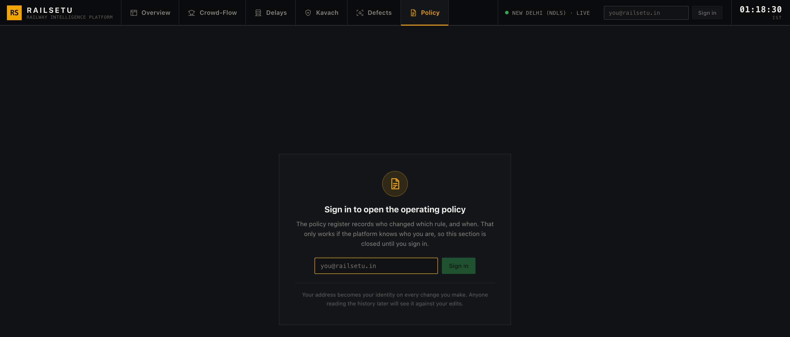

*Without an identity there is nobody to attribute a change to, so the register
does not open. The gate says so, and offers the field.*

</div>

An address is registered on first sign-in and persisted; a display name is derived
from it (`asha.rao@ir.gov.in` → *Asha Rao*). That identity then flows through every
push, revert and restore, and the change log is read by it. Identity is **asserted,
not proven** — the platform records who someone says they are so their edits are
attributable; anything that must resist impersonation needs a credential check in
front of it, and the code says so.

### Editing

<div align="center">

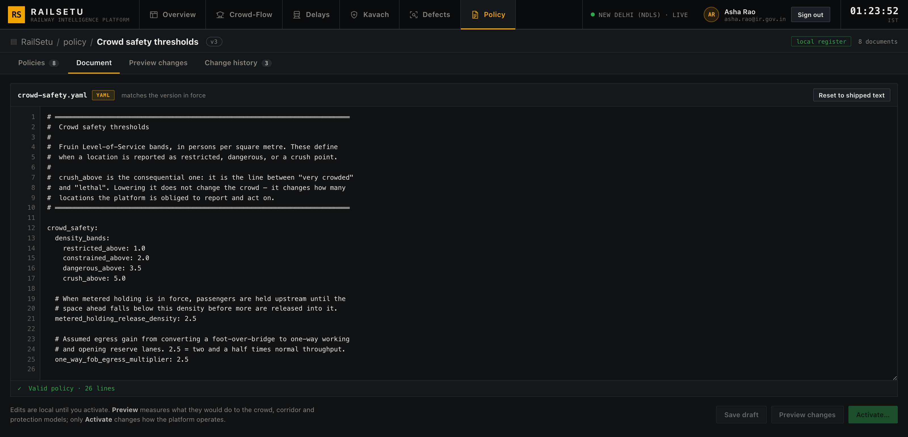

*Edit in place, with line numbers, live validation and the version in force.
Drafts save to local storage, so a half-finished amendment survives a reload.*

</div>

Three states, three buttons: **Save draft** (local only), **Preview changes**
(measure it), **Activate…** (put it in force). Nothing between the editor and the
register is implicit.

### Preview — the capability the challenge asks for

This is the part worth reading the code for.

<div align="center">

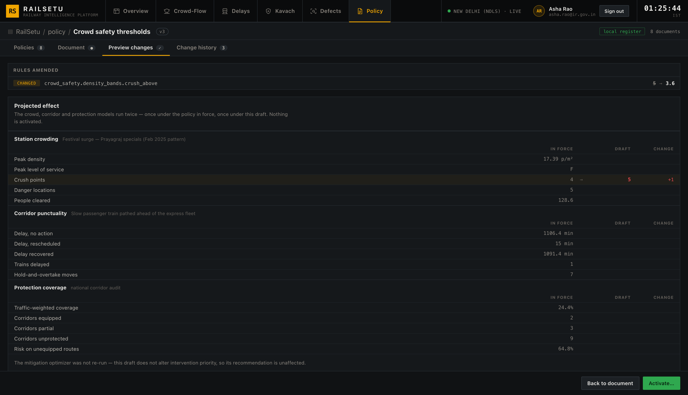

*Lower the crush threshold from 5.0 to 3.6 and the crowd model reports a fifth
crush point — measured, before anything is activated.*

</div>

A preview runs **the real models, twice**: once under the library as it stands,
once under the library with this draft substituted in. It reports:

- **Rules amended** — the semantic diff, in the document's own terms
  (`crowd_safety.density_bands.crush_above: 5 → 3.6`), not just the lines that moved.
- **Projected effect** — the crowd, corridor and protection models' own outputs
  side by side, with the deltas highlighted.
- **Document diff** — the literal GitHub-style line diff.

The mechanism is a `contextvar`:

```python
with use_policy(draft):
    preview = run_everything()      # draft rules; nothing persisted
```

The simulators never take a policy argument. They ask `current()` for the rules in
force, and a preview simply runs the *same code* under a different answer. That
matters twice over:

1. **The preview is exact.** It is not a parallel "what-if" implementation that
   could drift from the real one — it *is* the real simulation with one value
   swapped.
2. **It is safe under concurrency.** A `contextvar` is scoped to the block that
   set it, so one person previewing a draft cannot alter what anyone else's
   request computes. A module-level global would have made previewing a
   production-affecting act.

Rule-sets are validated *before* they can be previewed or activated. A band table
that does not increase strictly is refused, with the rule it broke named:

```
crowd_safety.density_bands must increase strictly:
restricted < constrained < dangerous < crush  (got [1.0, 2.0, 3.5, 1.5])
```

### Activating

<div align="center">

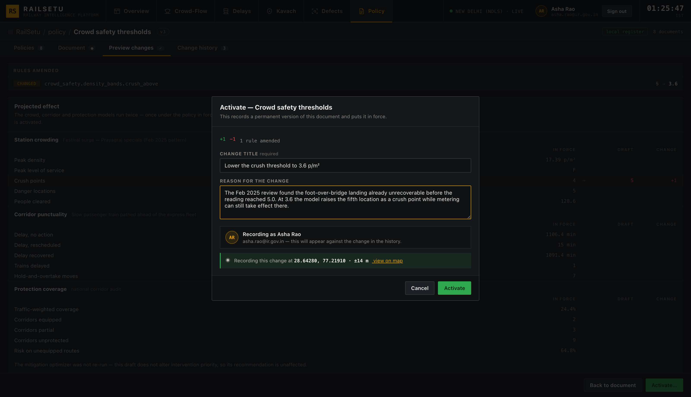

*A title and a reason are required. It does not ask who you are — it already
knows — and it tells you the coordinates it is about to record.*

</div>

An activated version is **immutable**. Correcting a bad policy means writing a new
version, never editing history — that is the whole point of a register: the record
of what was in force at a given moment has to survive the decision to change it.

Each version stores: the full text, the author's name and address, the timestamp,
the title and description, the line-diff stats, the semantic changes, the
**measured effect** at the moment of activation, the parent version, and where it
was pushed from.

### The change log

<div align="center">

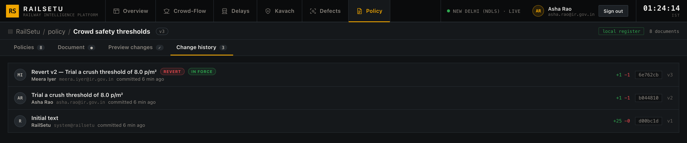

*Every amendment, newest first, with its author, its short id, its diff stats, and
tags for a revert or a restore.*

</div>

<div align="center">

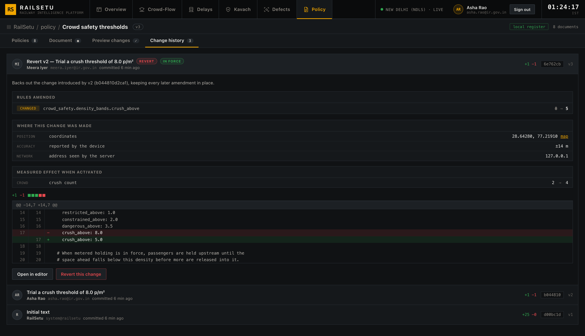

*Opened: the reason, the rules amended, where it was pushed from, the effect it
had when it was activated, the line diff — and the buttons to undo it.*

</div>

**Where a change was made.** Coordinates come from the browser's geolocation API
with the author's explicit permission. On a railway that is not incidental — an
amendment raised from the station it governs reads differently from one raised
from head office. Two rules, both deliberate:

- If permission is refused, or the device cannot fix a position, or the reported
  accuracy is worse than 100 km, the version records that **plainly**. An
  approximate position guessed from an IP address would be a fabrication dressed
  as evidence, and a register that fabricates is worse than one that admits a gap.
- The client address the server actually observed is recorded alongside. It
  corroborates the coordinates without pretending to be them.

### Undo — two different acts, as git has them

<div align="center">

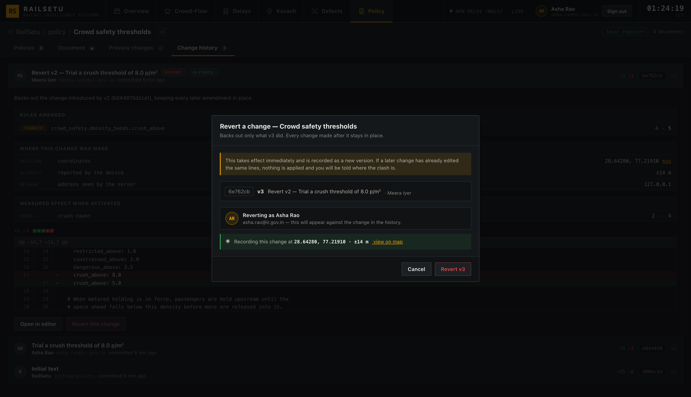

*Reverting v4 backs out only what v4 did. Everything done since stays.*

</div>

| | What it does | git equivalent |
|---|---|---|
| **Revert** | Backs out *only what that version introduced*, keeping every later change | `git revert` |
| **Restore** | Makes the document exactly as it was at that version, discarding what followed | `git reset --hard` |

Both are recorded as **new versions**, tagged as such. History is append-only.

Revert is implemented as a **reverse patch** ([`policy/diff.py`](backend/app/policy/diff.py)).
Take the diff that version *N* introduced (`parent → N`) and apply it backwards to
the text currently in force. Each changed block is matched against the current text
*with one line of surrounding context*, which anchors pure deletions and makes an
accidental match on a similar-looking line far less likely. Blocks are applied back
to front so earlier indices stay valid as the text is spliced.

If a block cannot be found — because a later version already edited those same
lines — that hunk is reported as a **conflict** rather than guessed at:

```
cannot back out v2 automatically
  expected:      metered_holding_release_density: 3.0
  would become:  metered_holding_release_density: 2.5
  reason:        already changed by a later version
```

A register that silently mangles a rule is worse than one that says it cannot do
this automatically. Three further refusals, all deliberate: reverting the initial
text (there is no parent — it points you at *restore*), reverting a change that has
already been backed out (a plain no-op message, not a conflict), and any revert
that would leave the document **invalid** — the rules are re-validated before the
result is written, and the document in force is left untouched if it would break.

### Adding a policy

<div align="center">

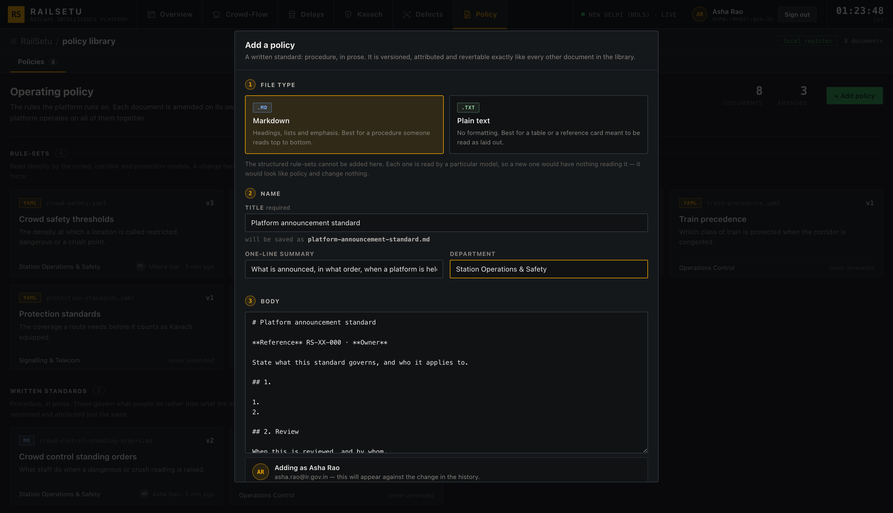

*File type → name → body. The filename is derived from the title as you type.*

</div>

New documents can be added from the UI as Markdown or plain text. Structured
rule-sets deliberately **cannot** be added this way, and the dialog explains why:
each one is read by a particular model, so a new one would have nothing reading it
— it would look like policy and change nothing.

### Where it lives

`PolicyStore` is the same seam already used for demand and crowd sensing: an
abstract store, a local implementation that needs nothing, and an S3 one selected
by configuration.

```
RAILSETU_POLICY_STORE=s3   # default — the register outlives any one host
RAILSETU_POLICY_STORE=local
```

S3 is the default *because* a change register that dies with its host is not a
register. If S3 cannot be reached the store degrades to local and says so in
`/api/health` rather than taking the platform down — and the S3 store probes the
bucket at construction, because boto3 will happily hand you a client that has
never been asked whether it works.

Each document has its own namespace, manifest and version chain, so amending crowd
thresholds never appears in the history of train precedence.

---

## The 3D layer

Both the station and the corridor render in three.js, through
[`@react-three/fiber`](frontend/src/three/). These are **not decoration and not a
separate model** — every vertex is derived from the same API payloads the 2D views
draw, so the 3D view is a projection of the graph the simulation actually ran on.

### The station

<div align="center">

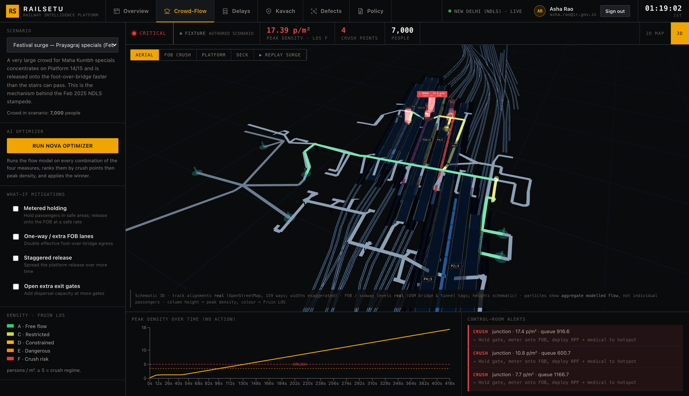

*New Delhi, built from `/api/station` and `/api/simulate`: node lat/lon → local
metres, edge kind → level, per-node density → column height and Fruin colour, and
particles flowing toward the nearest exit.*

</div>

| From the API | Becomes |
|---|---|
| node `lat`/`lon` | local metre positions |
| edge `kind` + `steps` | a two-level station — ground and foot-over-bridge deck |
| platform node PCA | track direction (platforms lie *across* the tracks) |
| per-node density | column height, coloured by Fruin LOS |
| distance to nearest exit | the direction crowd particles travel |
| 159 OSM rail ways | the track alignments under the platforms |

**One thing is inferred, and the UI says so.** The API carries no z-coordinate, so
levels are inferred by counting how many `steps` edges you cross to reach a node
from a platform. The caption on every frame reads: *track alignments **real**
(OpenStreetMap, 159 ways; widths exaggerated) · FOB / subway levels **real** (OSM
bridge & tunnel tags; heights schematic) · particles show **aggregate modelled
flow**, not individual passengers*.

Four cameras, each answering a different question:

<div align="center">

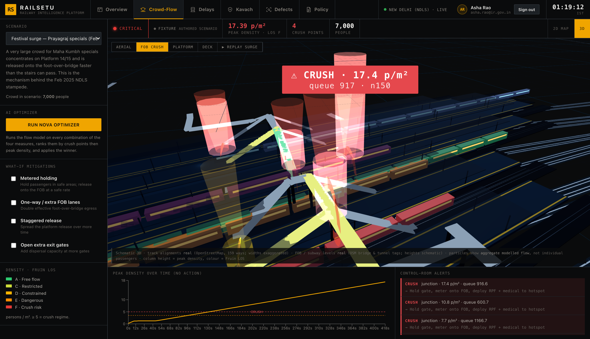

*<b>FOB crush</b> — the foot-over-bridge landing, where the model puts the crush.
Column height is density; the label is the live reading and its queue.*

</div>

<div align="center">

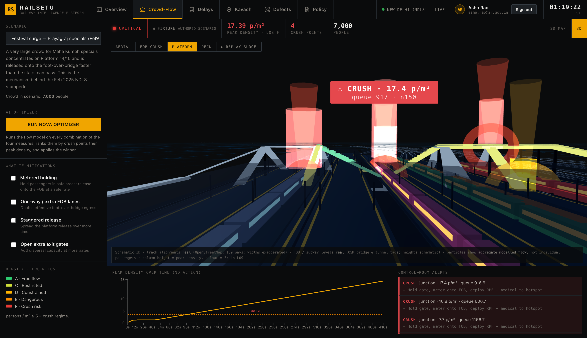

*<b>Platform</b> — eye level between the tracks, looking at what a passenger on
14/15 would be walking into.*

</div>

<div align="center">

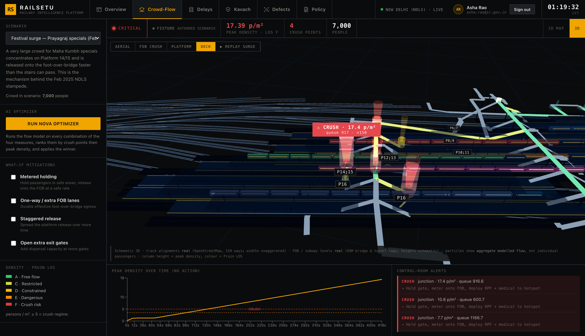

*<b>Deck</b> — the concourse level, where the holding space is.*

</div>

### The corridor

<div align="center">

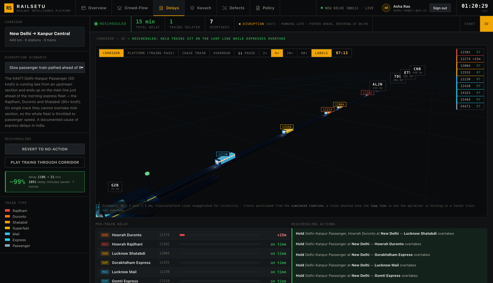

*440 km at 1 unit = 1 km, with every train positioned from its simulated timeline
at the current minute — and held trains shunted onto the loop line.*

</div>

Driven entirely by `/api/m2/network` and `/api/m2/simulate`: station `km` gives
position along the line, the timeline gives position at any simulated minute, and
`held_min > 0` puts the train on the **loop line** — so a hold-and-overtake is
something you *watch happen* rather than read in a table. The `progress` value
morphs every train between the no-action and rescheduled runs, in lockstep with
the string-line chart.

<div align="center">

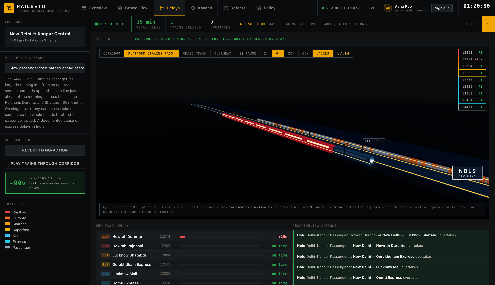

*<b>Platform (trains pass)</b> — a separate scene at 1 unit = 1 metre, because the
corridor's scale makes a platform a 5 km slab. Each train runs at **its own
simulated section speed**: under no-action the whole fleet crawls past nose to
tail at passenger speed; after rescheduling they tear through at line speed while
the held train sits on the loop.*

</div>

<div align="center">

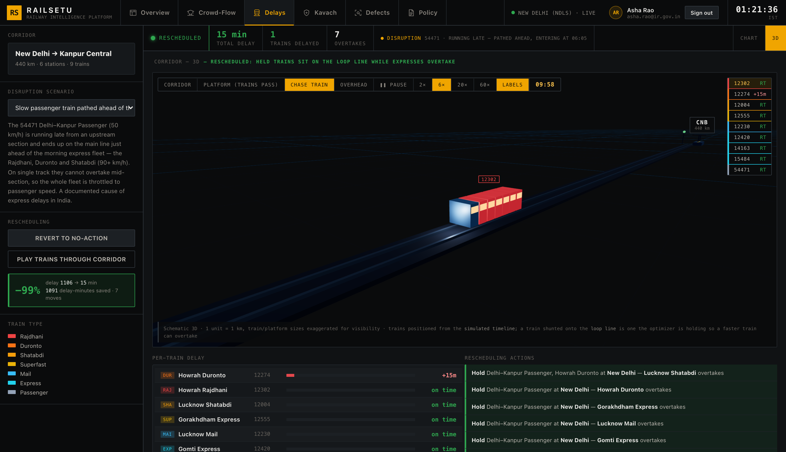

*<b>Chase train</b> — pick any train from the strip and ride with it down the
corridor.*

</div>

---

## Station Crowd-Flow

> **India problem:** recurring deadly stampedes from overcrowding, with no holding
> areas and no unidirectional flow planning during surges.
> **Japan solution adapted:** Shinjuku-style pedestrian origin-destination
> forecasting and simulation to find choke points and keep flow unimpeded.

<div align="center">

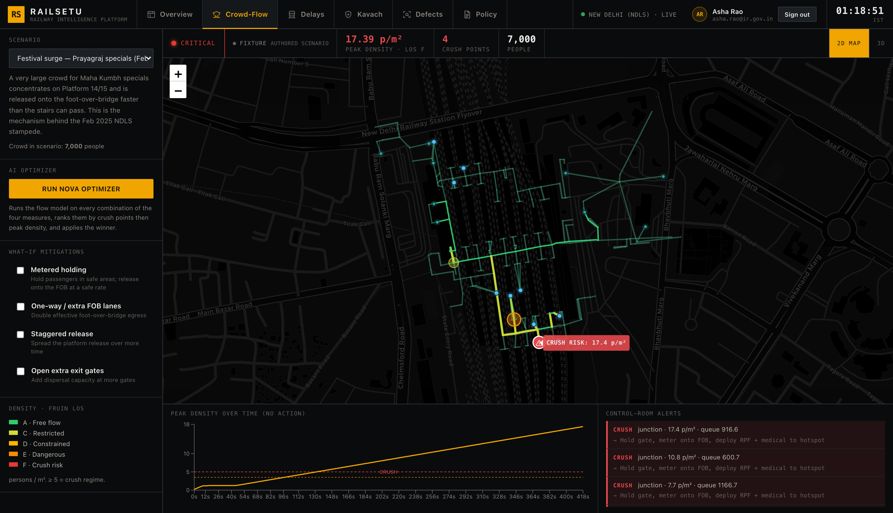

*Festival surge on New Delhi — the foot-over-bridge lights red, the crush marker
pulses, and the alert panel ranks the danger zones with a recommended action each.*

</div>

### How the model works

A **macroscopic origin-destination pedestrian-flow model**, not an animation:

1. **Real geometry.** A walkable graph built from a frozen OpenStreetMap snapshot
   — **245 nodes, 273 edges, 10 platforms, 9 entrances, three levels** (subway,
   ground, deck) — snapped into one connected component. *(The suite asserts that
   connectivity: a flow model on a disconnected graph silently strands people.)*
2. **Capacity-constrained flow.** People are injected at platforms and routed to
   their nearest exits. Every corridor passes at most its own `capacity_pps`,
   derived from width at the Fruin/HCM maximum specific flow and reduced on
   stairs. When demand exceeds capacity, people **queue** and density rises.
3. **The model finds the choke point itself.** The crush concentrates at node
   `n150` — the platform 14/15 foot-over-bridge landing, an *articulation point*
   every passenger on that platform must cross. That is exactly where Feb 2025
   happened. Nothing in the code names it.
4. **The fix is the science.** A stampede happens when there is **no
   back-pressure** — people keep pressing into an already-packed space. *Metered
   holding* adds that control: hold in roomy areas, release onto the bridge at a
   safe rate. That single change clears the crush.

Density is graded by the **Fruin Level-of-Service** bands, and those bands come
from `crowd-safety.yaml` — amend the policy and the whole run is re-graded.

| Scenario | People | Peak density | LOS | Crush points |
|---|---:|---:|:---:|:---:|
| Normal evening peak | 2,400 | 3.14 p/m² | D | 0 |
| **Festival surge (Feb 2025 pattern)** | **7,000** | **17.39 p/m²** | **F** | **4** |
| Double arrival | 5,000 | 12.20 p/m² | F | 1 |

### The mitigation optimizer

<div align="center">

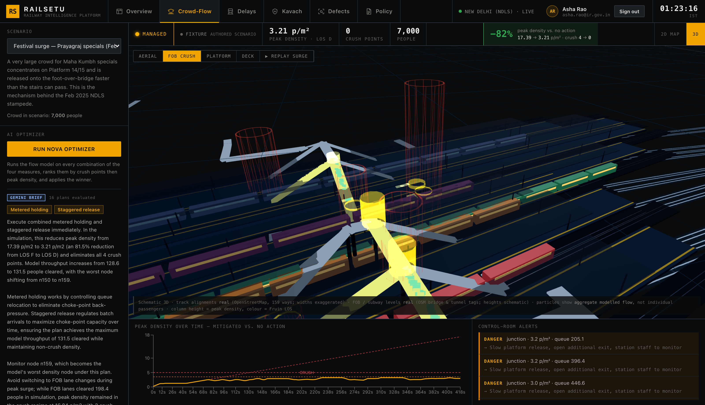

*After the optimizer: the hollow red wireframes are the no-action crush columns,
kept as ghosts. Inside them is what the recommended plan actually produces —
peak density down 82%, zero crush points.*

</div>

The control space is small and **fully enumerable**: four independent
crowd-engineering levers, 16 combinations. So it does not guess — it runs the real
pedestrian-flow simulation on **every combination** and ranks the outcomes. At
~100 ms a run that is ~1.7 s for an exact answer, which is strictly better than any
heuristic — or any language model — picking from the same 16 options.

The ranking is **lexicographic**, in the order a station controller actually cares
about, and that order is itself policy (`intervention-priority.yaml`):

1. **crush points** — the lethal regime. Non-negotiable, so first.
2. **peak density** — lower is safer even below the crush line.
3. **throughput** — people cleared in the horizon.
4. **measure count** — each measure costs staff, gates and announcements.

Points 3 and 4 only ever break ties between plans that are *already safe*, so the
optimizer never trades safety for convenience.

| | Peak density | LOS | Crush points | People cleared |
|---|---:|:---:|:---:|---:|
| No action | 17.39 p/m² | F | 4 | 128.6 |
| **Recommended: metered holding + staggered release** | **3.21 p/m²** | **D** | **0** | **131.5** |

An LLM is used for exactly one thing: writing the operator-facing brief that
*explains* the finished result. It does not choose. If the key is missing or the
call fails, the endpoint still returns the full recommendation and the brief falls
back to a deterministic template — the demo never depends on a network call.

---

## Delay Propagation & Rescheduling

> **India problem:** one late train on a saturated corridor cascades network-wide;
> recovery is manual and ad-hoc. **Japan solution adapted:** punctuality through
> *systematic rescheduling* — holds, overtakes, re-platforming — computed centrally.

**New Delhi → Kanpur Central**: 440 km, 6 stations, 9 real trains (Rajdhani,
Duronto, Shatabdi, Gorakhdham, Lucknow Mail…) on a representative timetable.

<div align="center">

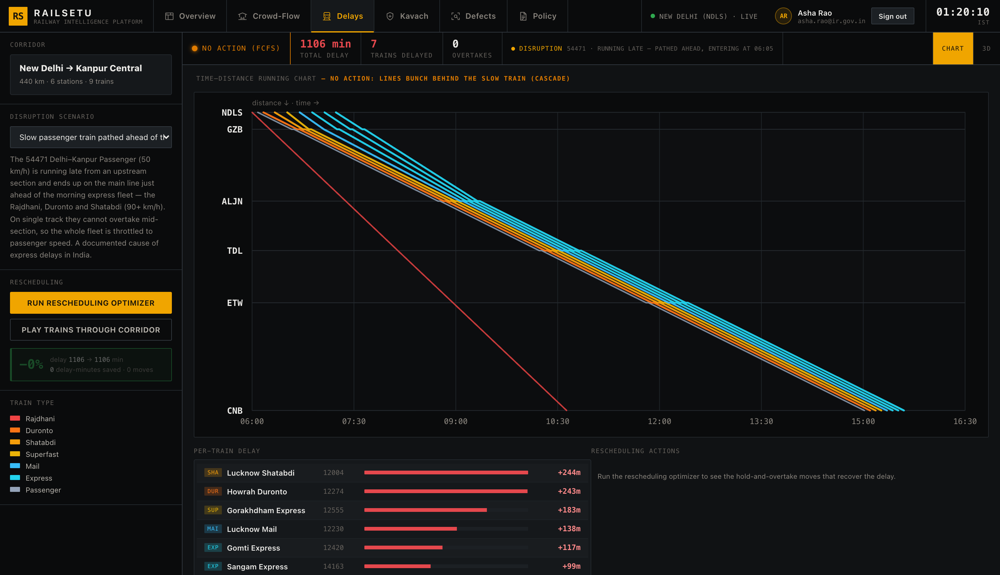

*No action: a slow passenger train is pathed ahead of the morning express fleet.
On single track they cannot overtake mid-section, so the whole fleet is throttled
to passenger speed — the lines bunch, and 7 trains lose 1,106 minutes between them.*

</div>

<div align="center">

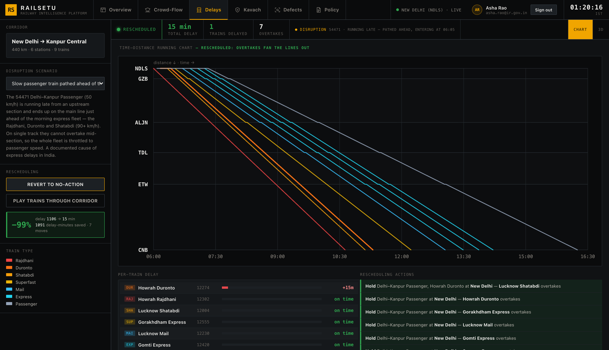

*Rescheduled: seven hold-and-overtake moves, and the lines fan out. 15 minutes
total delay, one train affected.*

</div>

### The two engines

**Delay propagation.** A section-by-section dispatch model. Trains are marched
down the corridor; at each station the dispatcher chooses who enters the section
next, subject to minimum headway, dwell, and the fact that **nobody overtakes
mid-section**.

**The rescheduling optimizer.** The `priority` dispatch policy leads on
**precedence** — which class of train is protected — with speed breaking ties
inside a class, and a speed margin below which an overtake is not worth taking.
Both come from policy (`train-precedence.yaml`, `corridor-operations.yaml`).

Because the default precedence table already ranks the fast premium services
highest, this reproduces the fastest-first (SPT) result on a normal day — letting
the quicker train go first minimises total downstream delay, since it would
otherwise be throttled behind a train it cannot pass. **But the two come apart the
moment someone edits the policy.** Lift PASSENGER above the expresses and the
dispatcher genuinely protects the commuter service, and total delay rises. That
trade is the point: it should be visible, and it should be a *recorded decision*
rather than a property of the code.

| Scenario | No action | Rescheduled | Recovered | Moves |
|---|---:|---:|---:|:---:|
| Normal running | 1.4 min | 1.4 min | — | 0 |
| **Slow passenger pathed ahead** | **1,106.4 min** | **15.0 min** | **1,091.4 min (98.6%)** | **7** |
| Passenger ahead + fault at Aligarh | 647.7 min | 28.0 min | 619.7 min (95.7%) | 7 |

> **Is it hardcoded? No.** The timetable is an authored fixture; the delay numbers
> and the optimization are **computed live**, by running the corridor simulation
> twice — first-come-first-served versus optimized — and diffing them. Change a
> train's speed, the disruption, or the precedence policy, and the result changes.

The signature visualization is a **time–distance string-line (Marey) chart**, the
classic railway diagram. Hit the optimizer and it morphs in real time; hit play and
a time cursor sweeps down the corridor with glowing train dots.

---

## Protection Gap Analysis

> **Important:** this is **not** Kavach and it does not control trains. *Kavach* is
> India's physical anti-collision system that automatically brakes a train. This is
> a **planning tool that maps where Kavach is missing and where the gap is most
> dangerous** — *Kavach is the seatbelt; this tells you which cars lack one, and
> which are driven on the most dangerous roads.*

<div align="center">

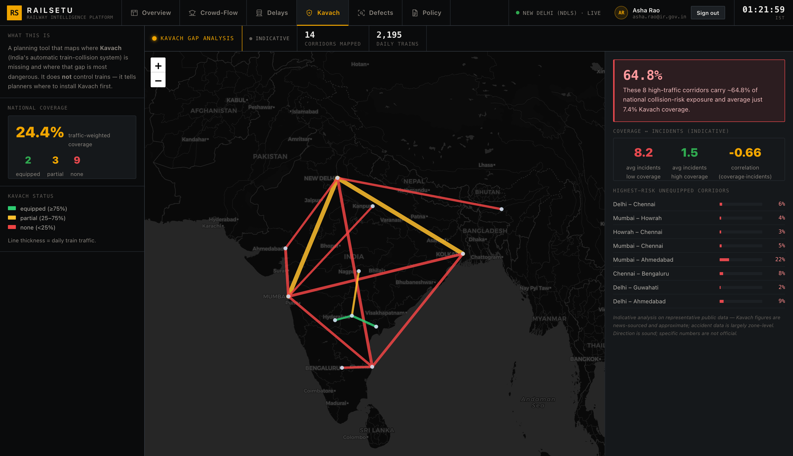

*14 trunk corridors coloured by status, line thickness = daily traffic, with the
gap-versus-incident panel beside it.*

</div>

- **Coverage.** 14 corridors carrying 2,195 daily trains: **2 equipped, 3 partial,
  9 unprotected**, for **24.4% traffic-weighted coverage**. Weighting is what makes
  the figure honest — a busy unprotected trunk route must count for more than a
  quiet one — and the status of each corridor is derived from the thresholds in
  `protection-standards.yaml`, not hard-coded.
- **Risk exposure** ranks each corridor by traffic against its protection gap.
- **The policy headline:**
  > **These 8 high-traffic corridors carry ~64.8% of national collision-risk
  > exposure and average just 7.4% Kavach coverage.**
- **Gap × incidents:** low-coverage corridors average **8.2** incidents against
  **1.5** for high-coverage ones (Pearson **−0.66**) — an *indicative* negative
  correlation, labelled as such, and never presented as causation.

Every figure here ships with its caveat attached: *indicative analysis on
representative public data — Kavach figures are news-sourced and approximate;
accident data is largely zone-level. Direction is sound; specific numbers are not
official.*

---

## Surface Defect Inspection

Two networks answer two different questions about one photograph.

<div align="center">

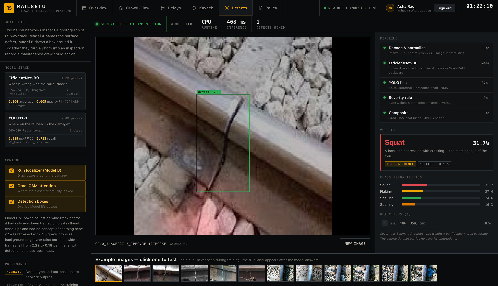

*Model A names the surface condition and Grad-CAM shows where it looked; Model B
boxes the damage. Together they produce an inspection record a maintenance crew
could act on.*

</div>

| | Model A | Model B |
|---|---|---|
| Architecture | EfficientNet-B0 | YOLO11-s |
| Question | *What* is wrong with the rail surface? | *Where* on the railhead is the damage? |
| Output | 4 classes: flaking · shelling · spalling · squat | 1 class: `defect`, as boxes |
| Size | 4.0M params | 9.4M params |
| Input | 224×224 RGB, ImageNet-normalised | 640×640 letterboxed |
| Held-out | **0.804** accuracy · **0.605** macro-F1 over 761 images | **mAP@50 0.819** · precision **0.887** · recall **0.733** |

**The retrain that mattered.** Model B v1 boxed ballast on wide track photographs:
it had only ever been trained on tight railhead close-ups and had no concept of
"nothing here". v2 was retrained with **216 gravel crops as background negatives**
alongside 221 positives. On the 60 wide frames held out for the check, false boxes
fell from **2.58 to 0.05 per image**, with detection on close-ups intact.

**Severity** is a *rule*, not a network output, and is labelled `ESTIMATED` on
screen: defect-type weight × confidence × area coverage. The source dataset carries
no severity annotations, so nothing could have learned it — and saying so is better
than implying otherwise.

**Engineering notes.** Torch is imported **lazily**, on the first request that
needs it: importing at module load would cost the whole backend several seconds of
start-up and a few hundred MB of RSS for a feature most requests never touch, and
would take the entire API down on a box where the ML extras are not installed. A
missing runtime degrades to `available: false` with the reason attached, and the UI
says so plainly. `railsetu-m3/predict.py` is the CLI twin of the service module —
rather than re-implementing checkpoint loading, preprocessing and Grad-CAM, the
service *imports and drives that file*, so the API and the command line cannot
disagree about what the models do.

---

## The unified overview

The Overview is what makes this a *platform* rather than five demos:

- **Live cards** pulled from each engine, click-through to open.
- **Cross-module incident timeline** — crowd alerts, corridor cascades and coverage
  findings stream into **one chronological feed**, which is the shared backbone
  made visible.
- **Japan vs. India benchmark** — cited Japanese figures (Shinkansen punctuality,
  ~1.6 min average delay) next to a **live figure from our own corridor model**.
- **Data provenance key** — the four labels every figure on the platform carries.

---

## Architecture

```
railsetu/
├── backend/                             FastAPI + the simulation / optimization cores
│   ├── app/
│   │   ├── main.py                       the API surface — 35 routes
│   │   ├── config.py                     env-driven settings (RAILSETU_*) + logging
│   │   │
│   │   ├── policy/                       ── the register ──
│   │   │   ├── documents.py               the library: 8 documents, their departments
│   │   │   ├── schema.py                  parse · validate · compose into rules in force
│   │   │   ├── context.py                 current() / use_policy() — the preview seam
│   │   │   ├── diff.py                    line diff · semantic diff · reverse patch
│   │   │   ├── store.py                   immutable versions, per document (S3 | local)
│   │   │   ├── location.py                where a change was pushed from
│   │   │   └── service.py                 preview · activate · revert · restore · add
│   │   ├── accounts/                     sign-in identity behind every recorded change
│   │   │
│   │   ├── m1_crowd/                     ── station crowd-flow ──
│   │   │   ├── simulation.py              O-D flow, capacity queueing, Fruin LOS, crush
│   │   │   ├── optimizer.py               exhaustive 16-plan search, lexicographic rank
│   │   │   └── scenarios.py               committed demand scenarios
│   │   ├── m2_delay/                     ── corridor ──
│   │   │   ├── network.py                 corridor, timetable, policy accessors
│   │   │   ├── engine.py                  section dispatch + precedence rescheduling
│   │   │   └── service.py                 API payload builders
│   │   ├── m6_kavach/                    ── protection ──
│   │   │   ├── data.py                    corridors, coverage, incident data
│   │   │   └── service.py                 traffic-weighted coverage + correlation
│   │   ├── m3_defect/service.py          ── the two networks; lazy torch, CLI twin ──
│   │   │
│   │   ├── data/station.py               loads / hot-reloads the routable walk graph
│   │   ├── demand/                       DemandProvider seam: fixtures | live rail API
│   │   ├── ingest/                       CrowdSensor seam + capacity calibration
│   │   └── clients/                      live-arrivals adapter · LLM brief writer
│   ├── scripts/build_station_graph.py    OSM → connected walk graph (run on a schedule)
│   └── fixtures/                         frozen snapshots (OSM graph, observations)
│
├── frontend/                            React 18 · Vite · three.js · Leaflet · Recharts
│   └── src/
│       ├── App.jsx                        shell, navigation, sign-in
│       ├── views/                         Overview · M1Crowd · M2Delays · M6Kavach
│       │                                  · M3Defect · Policy
│       ├── three/                         ── the 3D layer ──
│       │   ├── StationScene3D.jsx          station: 4 cameras, density columns, particles
│       │   ├── CorridorScene3D.jsx         corridor: 4 cameras, loop-line holds, playback
│       │   ├── PlatformPassScene.jsx       eye level, 1 unit = 1 m, per-train section speed
│       │   └── geo.js                      lat/lon → metres, level inference, LOS colour
│       ├── components/                    StationMap · IndiaMap · StringLineChart
│       │                                  · PolicyEditor · PolicyDiff · PolicyImpact
│       │                                  · PolicyLibrary · SignIn
│       ├── api.js                          typed fetch client
│       ├── session.js                      sign-in state
│       └── geolocation.js                  permissioned position capture
│
├── railsetu-m3/                         the two model checkpoints + their CLI twin
│   ├── predict.py                        loading, preprocessing, Grad-CAM — imported by the API
│   ├── artifacts/                        model_a_best.pt · model_b_v2_best.pt · metrics
│   └── testpack/                         12 held-out photographs
│
└── tests/                               see Testing, below
```

### The seams

Four abstractions, one pattern: an interface, a local implementation that needs
nothing, and a cloud one chosen by configuration. The demo runs offline; production
swaps the inputs **without touching a line of the simulation core**.

| Seam | Local | Production |
|---|---|---|
| `DemandProvider` | committed scenarios | live arrivals feed → platform → node → crowd |
| `CrowdSensor` | none / stub | CCTV crowd-counting or anonymised WiFi/AFC counts, **aggregate only** |
| `PolicyStore` | `fixtures/policy` | S3, versioned per document |
| `AccountStore` | `fixtures/accounts` | S3 |

---

## Why this is real engineering

| Claim | Evidence |
|---|---|
| Real pedestrian-flow physics | Capacity-constrained O-D flow on an OSM-derived graph, Fruin LOS grading, back-pressure metering — [`m1_crowd/simulation.py`](backend/app/m1_crowd/simulation.py) |
| Exact optimization, not a heuristic | All 16 mitigation plans simulated and ranked lexicographically — [`m1_crowd/optimizer.py`](backend/app/m1_crowd/optimizer.py) |
| Real scheduling | Section dispatch with headway, dwell and precedence, computed live and diffed against FCFS — [`m2_delay/engine.py`](backend/app/m2_delay/engine.py) |
| Real trained models | Two checkpoints with published held-out metrics, and a documented retrain that fixed a real failure mode — [`m3_defect/service.py`](backend/app/m3_defect/service.py) |
| Real geospatial analysis | Traffic-weighted coverage and risk exposure over 14 corridors — [`m6_kavach/service.py`](backend/app/m6_kavach/service.py) |
| Real geometry | OpenStreetMap → snapped, connected walk graph — [`scripts/build_station_graph.py`](backend/scripts/build_station_graph.py) |
| Policy genuinely drives behaviour | One `contextvar` seam; the same simulation code runs under draft rules — [`policy/context.py`](backend/app/policy/context.py) |
| Undo that is correct, not approximate | Context-anchored reverse patch with explicit conflicts — [`policy/diff.py`](backend/app/policy/diff.py) |
| Honest about data | Every output is labelled **real / modelled / indicative / estimated**, in the UI and in the payload |

**No language model is in any decision path.** The cores are algorithms; the one
LLM call writes prose about a decision that has already been made, and the platform
works without it.

---

## API reference

35 routes. Interactive docs at `http://127.0.0.1:8000/docs`.

**Platform**

| Endpoint | Purpose |
|---|---|
| `GET /api/health` | Liveness, station counts, and the status of every seam (demand, sensor, calibration, policy store, accounts, LLM) |

**Station crowd-flow**

| Endpoint | Purpose |
|---|---|
| `GET /api/station` | Geometry: nodes, edges, platforms, entrances, rail alignments |
| `GET /api/scenarios` | Demand scenarios (+ `live_now` when the live provider is on) |
| `POST /api/simulate` | Run a scenario with optional mitigations; per-edge and per-node density, hotspots, timeline |
| `POST /api/whatif` | Baseline vs. mitigated, side by side, with headline impact |
| `POST /api/optimize` | Simulate all 16 plans, rank them, return the winner and an operator brief |
| `GET /api/live/demand` | Inspect the demand the live provider currently derives |
| `POST /api/station/refresh` | Hot-reload the graph after a scheduled OSM rebuild (guarded) |
| `POST /api/calibration/run` · `/reset` | Calibrate corridor capacities against measured density |

**Corridor · Protection**

| Endpoint | Purpose |
|---|---|
| `GET /api/m2/network` | Corridor geometry and the planned train sheet |
| `GET /api/m2/scenarios` | Disruption scenarios |
| `POST /api/m2/simulate` | Propagate the disruption and compute the rescheduled plan, with impact |
| `GET /api/m6/coverage` | Coverage map: corridors, status, traffic, risk exposure |
| `GET /api/m6/correlation` | Gap × incident analysis and the ranked shortlist |

**Defect inspection**

| Endpoint | Purpose |
|---|---|
| `GET /api/m3/status` | Whether the runtime and weights are present; published metrics |
| `POST /api/m3/warm` | Load both networks ahead of the first request |
| `GET /api/m3/samples` · `/{id}` | The 12 bundled held-out photographs |
| `POST /api/m3/analyse` | Classify, localise, Grad-CAM and grade one image (upload or sample) |

**Identity**

| Endpoint | Purpose |
|---|---|
| `POST` · `GET` · `DELETE /api/session` | Sign in, read the current person, sign out |
| `GET /api/accounts` | Everyone the register has seen |

**The policy register** — every route requires a signed-in caller

| Endpoint | Purpose |
|---|---|
| `GET /api/policy/library` | Every document, with its version, author and department |
| `POST /api/policy/documents` | Add a written standard (Markdown or text) |
| `GET /api/policy/documents/{key}` | The text in force |
| `GET /api/policy/documents/{key}/default` | The text as first shipped |
| `POST /api/policy/documents/{key}/validate` | Validate a draft without running anything |
| `POST /api/policy/documents/{key}/preview` | **Run the real models under the draft**; diffs and measured deltas |
| `POST /api/policy/documents/{key}/activate` | Write an immutable version and recompose the rules in force |
| `GET /api/policy/documents/{key}/history` | The change log |
| `GET /api/policy/documents/{key}/versions/{id}` | One version, in full |
| `POST /api/policy/documents/{key}/revert` | Back out one change, keeping later ones (409 on conflict) |
| `POST /api/policy/documents/{key}/rollback` | Restore an earlier text as a new version |

---

## Run it locally

```bash
./run.sh          # backend on :8000, frontend on :5173
```

Then open **http://localhost:5173**.

<details>
<summary>Run the two halves manually</summary>

```bash
# backend
cd backend
python3 -m venv .venv && source .venv/bin/activate
pip install -r requirements.txt
RAILSETU_POLICY_STORE=local RAILSETU_ACCOUNTS_STORE=local \
  uvicorn app.main:app --reload --port 8000

# frontend (separate terminal)
cd frontend
npm install
npm run dev
```

`RAILSETU_API_PORT` and `RAILSETU_WEB_PORT` move the dev server and its proxy, so
a second stack can run alongside your own.

</details>

<details>
<summary>Defect inspection needs the ML extras</summary>

```bash
pip install torch torchvision ultralytics opencv-python-headless
```

`opencv-python-headless`, not `opencv-python` — ultralytics pulls in OpenCV, and
the GUI build wants `libxcb` and friends that a server image does not have.

Without these the platform runs normally and the Defects tab reports
`available: false` with the reason. Weights live in `railsetu-m3/artifacts/`.

</details>

Everything is **fixture-driven and network-free by default**, so the demo is
deterministic and never depends on a live call.

<details>
<summary>Going live — swapping fixtures for real feeds</summary>

Production swaps the static inputs for live ones through env config alone (see
[`backend/.env.example`](backend/.env.example)):

- **Live demand.** `RAILSETU_DEMAND_PROVIDER=live` switches from committed
  scenarios to a third-party live-arrivals feed; the adapter maps each arriving
  train's platform to a graph node and estimates the alighting crowd using
  `demand-assumptions.yaml`. If the feed is down it falls back to a fixture and
  flags it in `/api/health`.
- **Measured crowd + calibration.** A `CrowdSensor` ingests *observed aggregate*
  density; `POST /api/calibration/run` nudges corridor capacities toward reality.
- **Geometry refresh.** Re-run `scripts/build_station_graph.py` on a schedule, then
  `POST /api/station/refresh`.

> The third-party arrivals API is an NTES scraper — fine for a pilot; a real
> deployment should use authorised CRIS / RailTel / zonal-railway data access.

</details>

---

## Deployment

Live on AWS: an EC2 `t3.medium` behind nginx with TLS, the API under systemd, and
S3 for the policy register and accounts.

```
nginx  ──  /            →  the built SPA
       ──  /api/*       →  127.0.0.1:8000  (uvicorn under systemd)

uvicorn  ──  S3  policy/  accounts/
```

The service unit pins `OMP_NUM_THREADS=2` and `MKL_NUM_THREADS=2`: the box has two
vCPUs, and letting torch spawn a thread per core starves the web worker while an
inference runs. It also sets `YOLO_CONFIG_DIR`, because ultralytics writes settings
on first import and otherwise warns and falls back to `/tmp` on every start.

---

## Testing

```bash
./tests/run.sh          # everything — provisions its own stack, prints one total
./tests/run.sh api      # the Python suites (no browser, no server, no network)
./tests/run.sh ui       # the browser suites
```

```
tests/
├── run.sh                    provisions, runs everything, tears down, one total
├── api/
│   ├── harness.py             per-suite isolated store + the reporter
│   ├── test_crowd.py          geometry, LOS bands, flow, mitigations, the optimizer
│   ├── test_corridor.py       propagation, optimizer properties, precedence, timelines
│   ├── test_protection.py     coverage arithmetic, risk exposure, the public headline
│   ├── test_platform.py       the register end to end, over the API
│   ├── test_revert.py         revert vs restore, conflicts, no-ops, invalid results
│   ├── test_policy_units.py   schema, diff, reverse patch, context, location, accounts
│   └── test_defect.py         the two networks over HTTP, warm-up, uploads, guards
└── ui/
    ├── three.mjs              both 3D scenes, every camera, in headless Chromium
    ├── policy.mjs             the register in the browser, end to end
    ├── signin.mjs             the gate, the session, attribution
    ├── revert.mjs             undo from the change log
    ├── add-policy.mjs         adding a written standard
    ├── location.mjs           permissioned capture, and refusal
    └── defects.mjs            the inspection tab
```

Two ideas run through the suites and are worth stating.

**Each suite owns its state.** Every API suite provisions its own policy and
account store under `tests/.work/<suite>/`, and each browser suite gets a backend
with an empty register. Share one store and the third suite is asserting against
whatever the first two left behind — and the failure looks like a product bug
rather than test bleed.

**Assert the property, not the number.** A test that pins `peak_density == 17.39`
breaks the moment anyone tunes a constant, and tells you nothing about whether the
model is right. So instead: density rises when demand exceeds capacity; the crush
lands on the articulation point every passenger must cross; metering removes it
without stranding anyone; the optimizer never makes total delay worse; every train
it reports as held is one it actually held; a train is only stood aside for one
that outranks it under the precedence policy in force; narrowing the overtake
window in *policy* makes the dispatcher stop taking those overtakes. Those hold
whatever the timetable is — and fail when the model stops being a model.

---

## Data sources & honesty policy

Overclaiming loses. Every figure carries one of four labels, and the UI shows it:

| Label | Means | Examples |
|---|---|---|
| **Real** | Exact, sourced facts | Station geometry (OpenStreetMap), the train list, festival dates |
| **Modelled** | Computed by our algorithms, against our own baseline — not ground-truth validated | Crowd densities, delay cascades, delay-minutes saved, defect class and box |
| **Indicative** | Directionally sound on coarse public data; specific numbers are soft | Kavach coverage %, gap × incident correlation |
| **Estimated** | Derived where the source gives no number | Defect severity, passenger load from the live arrivals feed |

**Privacy & non-goals.** Aggregate density only — never identifiable individuals.
No live signalling integration, no trackside hardware, no control authority. This
is decision support, calibrated to standard pedestrian-flow constants and to be
tuned against site data before any real deployment. Identity is asserted, not
proven. Coordinates are captured with permission or not at all.

---

## Roadmap

Architected on the same backbone:

| Feature | Description |
|---|---|
| Public crowd-status app (PWA) | Passenger-facing live crowd level per gate, with directional guidance |
| Festival surge calendar | Forward-looking "festival in 3 days" forecasting |
| Level-crossing safety | CV obstacle detection and emergency dispatch |
| Waitlist & coach-load intelligence | Where the space actually is, before the train arrives |
| Historical validation | Back-test the rescheduling optimizer against real delay history |
| Policy approvals | Two-person sign-off before a rule-set amendment takes force |

<div align="center">

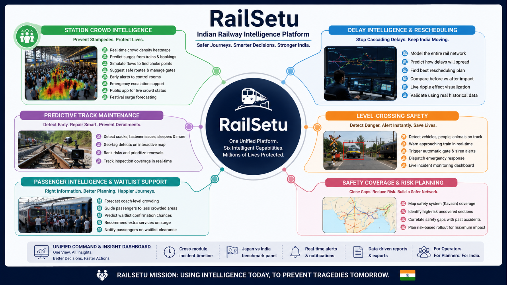

*The idea behind RailSetu.*

</div>

---

<div align="center">

Built by **Saswata · Mahir · Dhruv** — Team **Daddy Debuggers** — for **FAR AWAY 2026**.

*Framed preventively, in memory of those lost — the goal is to save lives.*

**If even one family is spared the pain of another New Delhi stampede,
every line of code was worth it.**

</div>
